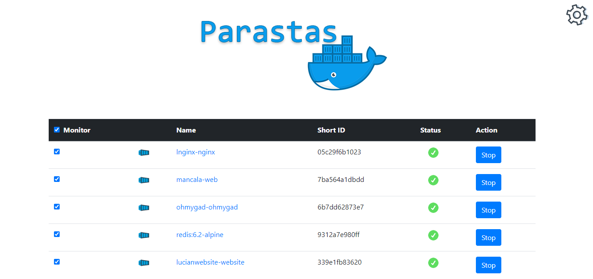

# Parastas

A simple docker container watcher to keep an eye out for running containers and notify when any of them go down.

### Why?

Like everyone else, I have some applications running in docker containers on my raspberry pi. Sometimes these apps crash and I don't know about it unless I go and check their status. I could of course install a fully fledged monitoring tool like Prometheus, or maybe make a small script and put it in a cronjob, but I thought this could be a good opportunity to learn Spring framework.

### How to use

- Make sure you have you have docker expose daemon on localhost:2375
- Clone the project
- run ./build_docker.sh
- docker compose up -d
- open up localhost:8080 (default admin: admin)
- Got to Settings and update your credentials and SMTP settings

If everything is ok you should see the list of running docker containers. Check the ones you want to monitor

### NOTE
** If you are using Gmail SMTP server don't forget to "allow less secure apps" in you Gmail settings or create an "app password" if you have 2FA enabled.**

### TODO:

 - [X] Add latest logs in the email notification.
 - [X] Add ability to click on container and see latest logs.
 - [X] Add error page
 - [X] Add auth
 - [ ] List docker containers async, to speed up pageload
 - [ ] Add tests (in progress)
 - [ ] Add browser side rendering
